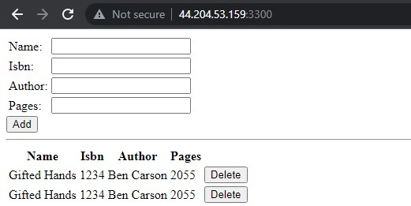

### Step 1: Install NodeJs
- `sudo apt install -y nodejs`

### Step 2: Install MongoDB
- `sudo apt install -y mongodb`
#### Create a folder named ‘Books’
- `mkdir Books && cd Books`

### Step 3: Install Express and set up routes to the server
- `sudo npm install express mongoose`

### Step 4 – Access the routes with AngularJS
- Change the directory back to ‘Books’
- Create a folder named public
- Add a file named script.js
- In public folder, create a file named index.html
- Change the directory back up to Books
- Start the server by running `node server.js`
- The server is now up and running and can be access on internet by opening TCP port 3300

# Side Study
[OSI vs. TCP/IP Model](https://www.imperva.com/learn/application-security/osi-model/)
[Load balancing](https://www.nginx.com/resources/glossary/load-balancing)
